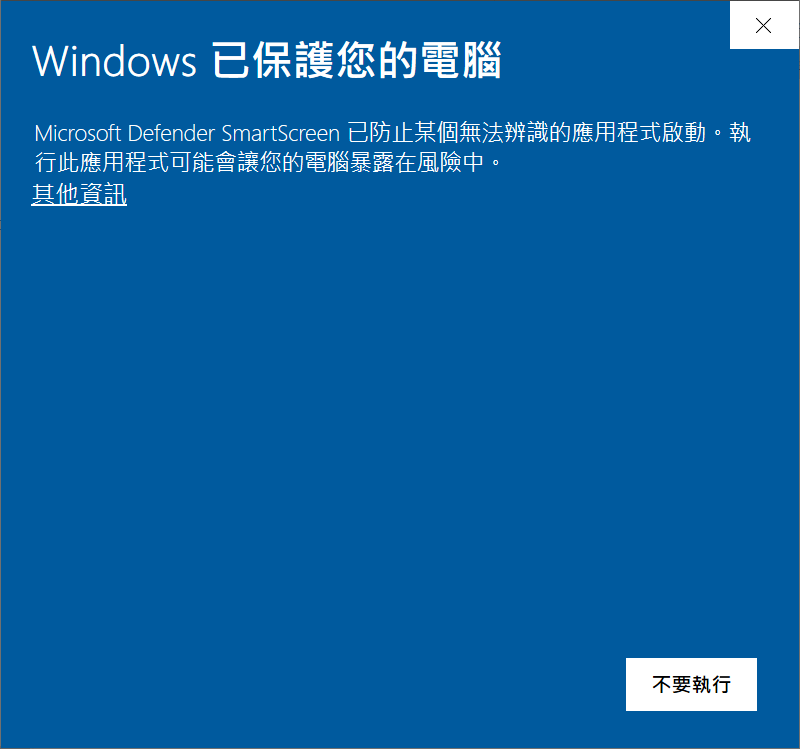
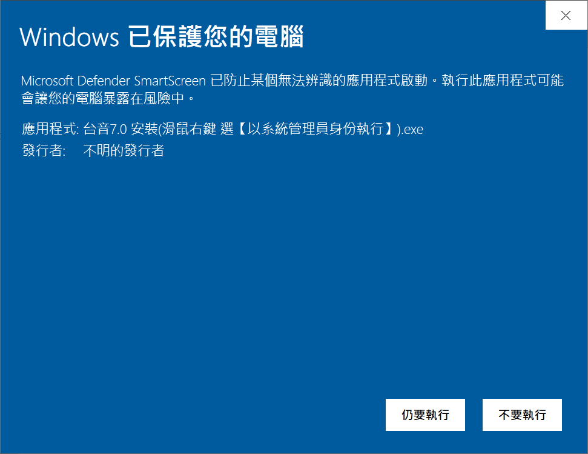

<!-- 
# 台音7.0　daiim7.0   
通用拼音 台華輸入法  
輸入時 支援 台語華語 通用拼音 審定標準+相容+快打 拼寫法，  
輸出時 顯示拼音 預設 審定標準，  
再加上 自動詞條記憶 等等。  現在 只有 Win10版。  
-->

# 台音7.0 主要特色 (台華語 共同)   
【隨時提示】 克服 拼音無夠熟 (尤其是 台語)  
【多字輸入】 減少選字麻煩  
【免打聲調】 快速方便  
【相容輸入】 相近拼音 容異  
【自動記憶】 使用中 個人化    


<!-- 【單字專齒】　[space]預選轉換  -->

<!-- ## slides <a href = "https://sites.google.com/view/daiim70etc/home"> slides</a> -->
  
  
<!--big> 下載  <a href="di%E5%8F%B0%E9%9F%B37.0%E5%AE%89%E8%A3%9DWindows%E7%89%88_20200819.zip" download>台音7.0 安裝程式</a> </big-->

---  

## ● 下載　<a href="di%E5%8F%B0%E9%9F%B37.0%E5%AE%89%E8%A3%9DWindows%E7%89%88_20201016.zip" download>台音7.0 安裝程式</a> (2020.1016 版本)　　 (前版 2020.1009)  

<!-- ### 更新中， 請等待 -->

若 **安裝過** 先前舊版【2020.0817之前版本】， 請先閱讀 後面 【記憶詞條 更新須知】     


<!--a id="raw-url" href="di%E5%8F%B0%E9%9F%B37.0%E5%AE%89%E8%A3%9DWindows%E7%89%88_20200819.zip">Download File 3</a-->


1. 下載後， 解壓縮  
2. 點進 資料夾， 點選 【台音7.0 安裝(滑鼠右鍵 選【以系統管理員身份執行】).exe】  
3. 滑鼠右鍵 選單: 選擇 【以系統管理員身份執行】 執行安裝  
  
過程 大約 ≦1分鐘  (【更新安裝】 可能需要 重新開機)  
(安裝 若無成功， 見後面 【防毒軟體】)     
  
最少須知   
- 輸入法 **起動**：【Windows+Space】 數次， 選擇【台音7.0】
- 輸入窗 **顯示**： 至少 打1齒 字母/數字鍵
- 輸入法 **選單**： 輸入窗中 滑鼠右鍵

### **Happy Typing**  

---   

###  試驗    
<iframe width="560" height="315" src="https://www.youtube.com/embed/EUHkI0PzWBg" frameborder="0" allow="autoplay; encrypted-media" allowfullscreen> 花車gàh₆貨車 </iframe>   

<!-- 
https://www.youtube.com/watch?v=EUHkI0PzWBg   花車gàh₆貨車
some said key to show is "embed" in youtube address
<iframe width="560" height="315" src="https://www.youtube.com/embed/dQw4w9WgXcQ" frameborder="0" allow="autoplay; encrypted-media" allowfullscreen></iframe>
-->


---

## 【輸入法安裝 & 防毒軟體】  

● 【防毒軟體】有時  會出來阻止 輸入法 安裝   
　 (甚至是 無聲阻止， 致使 安裝結果未知)  
● 如果 發生/懷疑 防毒軟體 來阻礙    
　一般策略 是 【暫時關閉 防毒軟體】  
　　• 先關掉 防毒軟體　• 安裝輸入法　• 開啟 防毒軟體  
　特別策略 是 【移除舊版， 再行安裝】  
安裝前 無妨 用防毒軟體 掃瞄 安裝程式  

安裝 是m̨是成功 請告知。  


防毒軟體2大：  
● McCafe  (我ｅ電腦Asus 預裝)  
● PC-cillin (無真正有經驗)  

以下 是 發生過 3例(總共 只有3次)  

1. Windows Defender (可能輕微)  
　(McAfee過期， 退化成 Windows Defender)  
　• 出現 下圖1。 點選 中央【其他資訊】  
　• 出現 下圖2。 點選 下方【仍要執行】  
　• 防毒軟體 加開 大約半分鐘 掃毒， 再繼續安裝   
1. codomo  (嚴重， TeamViewer手動安裝)  
1. kabasky (古早dù₄過， 暫時關閉 防毒軟體)  
  
       

--- 

## ● 【記憶詞條 更新須知】 @2020.1006   

台音7.0 記憶詞條   
　卡舊版本 需要手動更新(∵ 檔案格式、拼音拼寫 改過)   
　之後版本 自動更新     
卡舊版本： 2020.0817之前版本   


因此，   
(1) 如果 記憶詞條無濟＆放棄， 可直接 輸入法更新  
(2) 如果 bheh₆保留 記憶詞條， 請連絡作者    
　　(作者 限時服務： 用TeamViewer 來手動更新)  

<!-- 
## ● 【記憶詞條 更新須知】 @2020.0924   

台音7.0 記憶詞條   
　卡舊版本 需要手動更新(∵ 檔案格式、拼音拼寫 改過)   
　之後版本 自動更新     
卡舊版本： 2020.0817之前版本   

因此，   
(1) 如果 記憶詞條無濟＆放棄， 可直接 輸入法更新  
(2) 如果 bheh₆保留 記憶詞條， 見後面 【舊版詞條 更新程序123】  
　　(或者是 通知作者 安排 可能手動更新)  


## ● 【舊版詞條 更新程序123】： (2020.0817之前版本)   
　　(之後版本 自動更新)   
(1) 【備份＆修正】  
　　【輸入法更新 之前】  
　　【舊版輸入法】叫出 詞條編輯.exe  
　　將 長期/短期/編輯 詞條 copy過 word/notepad++ 等  
　　並且 (華語) ㄝㄜㄦ e/er/err → e/e/er  
　　【儲存】 檔案  
(2) 安裝 【新版輸入法】   
　　　安裝後 可能需要 重新開機  
(3) 【匯入＆製作】
　　【新版輸入法】 叫出 詞條編輯.exe  
　　將 【備份＆修正】詞條 貼入 編輯區   
　　【製作 長期詞典】  
　　如果 成功， 備份 可以刪除  
　　如果 失敗， 儲存【備份＆修正】， 聯絡作者  
done  
舊版使用 應該無濟， 作者 可能可提供 "詞條更新服務"  
這是 舊版更新 遺留問題  
希望 近期內 解決， 以後 免再提  


【舊版 記憶詞條】 需要 麻煩更新，   
是因為   
(1) 格式　 改過， 舊格式 需要 舊程式 讀出   
(2) 拼寫法 改過， (新拼寫法 全支援 通用審定標準)  
　　華語：ㄝㄜㄦe/er/err → e/e/er， 其他 自動處理   
　　台語：自動處理   

-->


<!--  
## ● 【台音7.0 內部拼寫】  

因為 種種關係，   
● 台音7.0 內部拼寫 無全等於 通用審定標準：  
華語：  
　子音音節 使用 子音重複 (如 shih→ssh)  
　凹ㄠ 用ao  
台語：  
　煙ㄧㄢ 用 ian， 無用en  
　呵ㄜ 用 er， 無用or  
　帽鵝 用 v/q 
　後ㄠ 用 au  
但是   
● 輸入時 拼寫轉換 使得 可以 相容輸入  
● 拼音顯示時 使用 審定 通用標準  
-->


<!--
以下參考
-->

<!--
good tutorial for GitHub pages (8::39)
https://www.youtube.com/watch?v=BA_c3bGQXlQ
-->


<!-- 
theme: jekyll-theme-cayman
github:
  is_project_page: false
-->
<!-- 
theme: jekyll-theme-cayman
github:
  is_project_page: false
show_downloads: true
-->

<!-- 
You can use the [editor on GitHub](https://github.com/izgang/daiim7.0/edit/master/README.md) to maintain and preview the content for your website in Markdown files.

Whenever you commit to this repository, GitHub Pages will run [Jekyll](https://jekyllrb.com/) to rebuild the pages in your site, from the content in your Markdown files.

### Markdown

Markdown is a lightweight and easy-to-use syntax for styling your writing. It includes conventions for

```markdown
Syntax highlighted code block

# Header 1
## Header 2
### Header 3

- Bulleted
- List

1. Numbered
2. List

**Bold** and _Italic_ and `Code` text


[Link](url) and 
```


For more details see [GitHub Flavored Markdown](https://guides.github.com/features/mastering-markdown/).

### Jekyll Themes

Your Pages site will use the layout and styles from the Jekyll theme you have selected in your [repository settings](https://github.com/izgang/daiim7.0/settings). The name of this theme is saved in the Jekyll `_config.yml` configuration file.
-->

